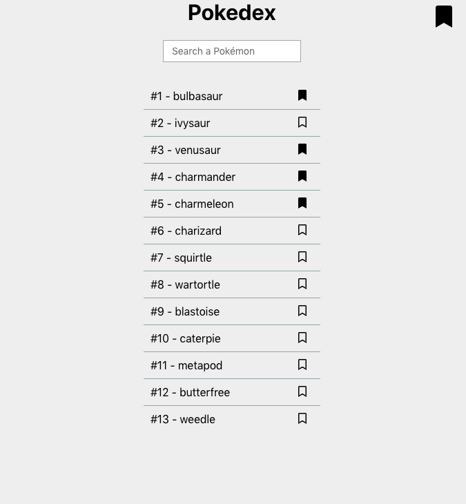

# pokedex

A simple react pokedex app for experiments.

## Quickstart

You can test the app at the available URL at the top of this page.

## screenshot

| Home | Details |
|------|---------|
|              |  |
|   |  |

## features

* Browse Pokemons list
* Search a Pokemon by name or by id
* Compare a Pokemon's statistics with all others Pokemons of the same type(s)
* View live Tweets about a Pokemon
* Like or dislike a Pokemon

## development

* Clone the repo with `git clone https://github.com/rootasjey/pokedex`
* Go to the cloned repo with `cd pokedex`
* Install dependencies with `yarn` or `npm install`
* Run the app with `yarn run start` or `npm start`

## 3rd party libraries

* [fontawesome](https://fontawesome.com)
* [graphql-request](https://github.com/prisma/graphql-request)
* [maetrial-ui](https://material-ui.com/)
* [mobx](https://mobx.js.org/index.html)
* [react](http://reactjs.org)
* [react-list](https://github.com/coderiety/react-list#readme)
* [react-router](https://reacttraining.com/react-router/web/guides/quick-start)
* [styled-components](https://www.styled-components.com)
* [typescript](http://typescriptlang.org)

## Licence

MIT Licence
