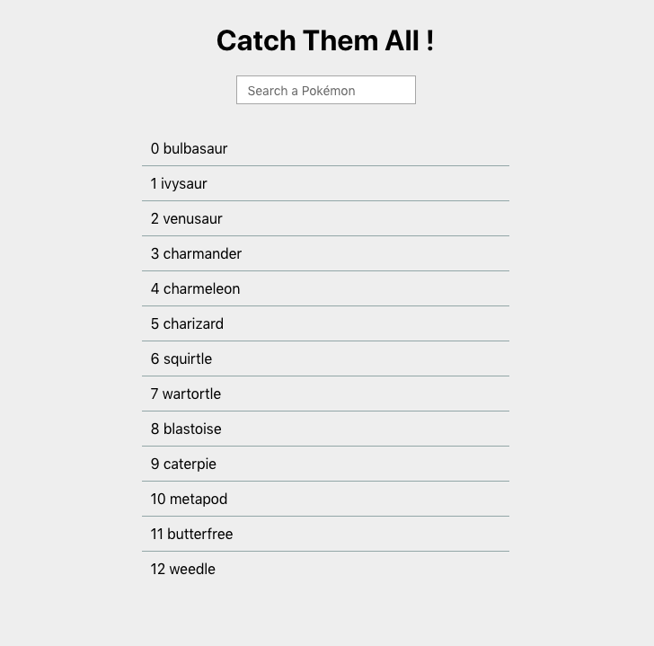
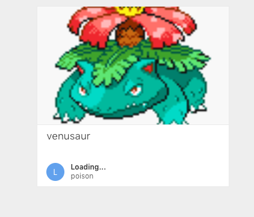

# pokedex

A simple react pokedex app for test purposes.

## screenshot

## development

* Clone the repo with `git clone https://github.com/rootasjey/catchthemall`
* Go to the cloned repo with `cd catchthemall`
* Install dependencies with `yarn` or `npm install`
* Run the app with `yarn run start` or `npm start`

## tools

* [fabric](https://developer.microsoft.com/en-us/fabric)
* [fontawesome](https://fontawesome.com)
* [graphql-request](https://github.com/prisma/graphql-request)
* [mobx](https://mobx.js.org/index.html)
* [react](http://reactjs.org)
* [react-router](https://reacttraining.com/react-router/web/guides/quick-start)
* [styled-components](https://www.styled-components.com)
* [typescript](http://typescriptlang.org)

## Licence

MIT Licence
